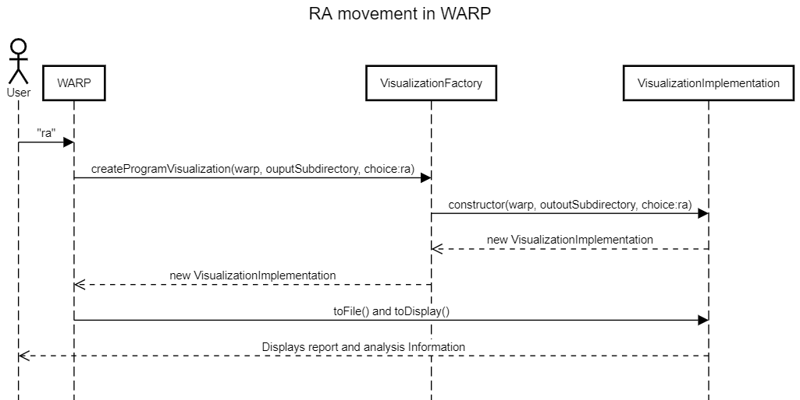
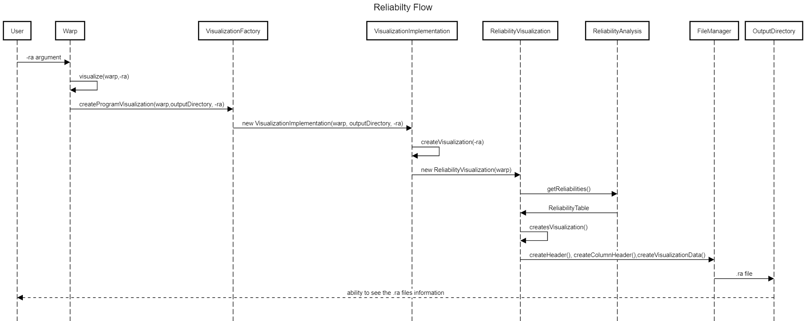
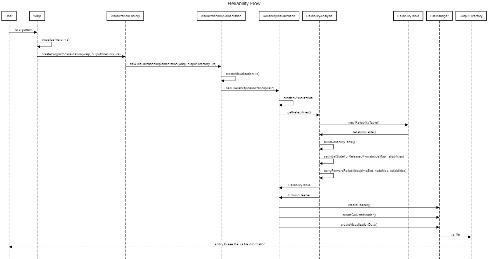

# CS2820 Spring 2023 WARP Project Code  
All of the things below are true.
 
Name: Kennedy Bombei
 
HawkID: bombei
 
For HW 0 we edited the run configurations with different commands and saw how that
changed the output in the Output folder. That was cool. 
To edit configurations go to run -> run configurations and edit the arguments
 

This code base will be used for the University of Iowa CS 2820 Introduction to Software
Development course. The code was developed by Steve Goddard for the WARP sensor network 
research project. It was first written in Swift and rewritten in Java. It was then 
rewritten again in an object-oriented programming style. It was a quick
hack, and it needs a lot of cleanup and refactoring. A perfect code base to teach
the value of software developement fundamentals!
 

## First ReadMe
Ran initial tests and downloaded files to output folder.

## HW1 1/26
Updated WorkLoadDescription to take .txt files and output them in alphabetical
order with their associated flow numbers.

## HW2 Partner Assignment 
Kennedy Bombei completed questions 2, 3, 6a,b,c,d,e,f,g,h,i,j,k, 7a,b. 
Ayman Noreldaim completed questions 4, 5, 6l-w, 7c.

We deleted comments from the code when it was repetitive from our javaDoc comments. 

## HW3 Partner Assignment 
Kennedy Bombei completed questions a-h. 
Ayman Noreldaim completed questions i-p.

## HW4 UML Lab
I created a UML diagram for ScheduelableObject (showing only its children and public elements), a UML diagram for WorkLoad (showing its parents, associated classes, and all elements), a UML diagram for all of the Reliability classes (showing the parents and associated classes for ReliabilityVisualization). In the Reliability UML diagram I added a public getReliabilities method.

## HW5 Refactoring
Kennedy Bombei used UML lab to generate code for the new numTxPerLinkAndTotalTxCost method and both Reliability Analysis methods. Then I refactored these methods, speficying variable types, utilizing arrayList, and replacing ReliabilityRow and ReliabilityTable with Vector<Double> and Vector<Vector<Double>>. I added comments throughout to speficy what each step is doing. 
Dylan Fair removed the numTxAttemptsPerLinkAndTotalTxAttempts and getFixedTxPerLinkAndTotalTxCost methods, updating and refactoring code. He also added JavaDoc comments to the new/updated methods. 

## Sprint 1 
Dylan Fair and Sam Burkhart Creates the UML Sequence Diagram for the Warp Process 
Ayman Noreldaim did the ReadMe File 
Kennedy Bombei and Ayman did the Microsoft Word Plan documents. 
[Project Plan](./Sprint1_Design_and_Project_Plan__1_.docx) 

## Sprint 2
Dylan Fair - Created ReliabilityVisualization and ReliabilityAnalsys Methods and updated the ReadMe. Dylan also recreated our sequence diagram, adding the classes/methods we missed from Sprint 1 and updated it with the new methods used in our implementation of the ReliabilityAnalysis and ReliabilityVisualization classes. In Sprint 3 Dylan will take the lead on correcting the CreateVisualization method by utilizing the ReliabilityAnalysis and InstructionParameters classes, and will update the sequence diagram again if needed.

Sam Burkhart - Created ReliabilityVisualization Methods and added JavaDoc comments. In Sprint 3 Sam will correct the CreateVisualization method by utilizing the ReliabilityAnalysis and InstructionParameters classes and will update the ReadMe.

Kennedy Bombei - Created ReliabilityVisualization Methods, created the Sprint 2 Design and Project Plan, added JavaDoc comments, updated the ReadMe and updated the UML class diagram with the new methods created. In Sprint 3 Kennedy will correct the CreateVisualization method by utilizing the ReliabilityAnalysis and InstructionParameters classes and will update the UML class diagram and add JavaDoc comments.

Ayman Noreldaim - Completed JUnit tests for the methods in both the ReliabilityVisualization and ReliabilityAnalsys classes, testing based on expected method output and by reading our output .ra file. In Sprint 3, Ayman will again take the lead on JUnit testing, making sure all tests pass to ensure code correctness in the final sprint.  

## Sprint 3

Dylan Fair: 
-Took charge in writing the majority of code in ReliabilityVisualization and Reliability Analysis classes. He corrected the createVisualization method, and the getReliabilites method to correctly populate our table's data and to reset with 1 in the correct places. The methods we added were: getReliabilites, buildReliabilityTable, carryForwardReliabilities, setInitalStateforReleasedFlows,printRaTable, getFinalReliabilityRow, verifyReliabilities, setReliabilities, setReliabilityHeaderRow, getReliabilityHeaderRow, getColumnHeader, ReliabilityNode, and a NodeMap class that extends hashMap 
-Helped make sure JavaDoc comments were accurate  

Kennedy Bombei: 
-Added JavaDoc Comments to all global variables and methods in ReliabilityVisualization and Reliability Analysis.  
-Regenerated UML diagram for all new methods 
-Completed ReadMe 
-Helped look over/edit ReliabilityVisualization and Reliability Analysis code for correctness  

Sam Burkhart: 
-Updated the sequence diagram for Sprint 3 with new called methods and fixed errors from last time. 
-Helped look over/edit ReliabilityVisualization and Reliability Analysis code for correctness  

Ayman Noreldaim: 
-Took charge writing the jUnit tests for the changed/added methods for ReliabilityVisualization and Reliability Analysis classes. He made sure all of our methods give the correct output by testing method output directly and comparing to the output .ra file generated. He also tested edge cases, for example when changing the e2e value.  

